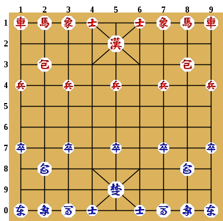

장기 게임의 장기말의 목록과 각 장기말들의 움직임에 대해 구현을 시작함.

먼저 장기판은 가로 9줄, 세로 10줄로 구성된 격자 공간으로 시작된다.
(엄밀하게 격자 공간 안에서 장기말이 움직이는 것이 아니라, 격자 공간의 교차점에서 움직임)



상단 맨 좌측과 우측에 한나라 진영의 차가 위치하고, 반대로 하단 좌/우측에 초나라 진영의 차가 위치한다.

포진은 아래와 같은 형태가 있다.
- 귀마: (상,마,상,마) 또는 (마,상,마,상)
- 원앙마: (마,상,상,마)
- 양귀마: (상,마,마,상)

만약 한과 초 모두 귀마(상,마,상,마) 포진을 한다고 가정할 경우,
한나라 좌측(한나라에서 초나라를 바라보는 방향(북에서 남)에서 좌) 차는 (1,9) 위치에, 우측 차는 (1,1) 위치에 놓이게 된다.
초나라 좌측(초나라에서 한나라를 바라보는 방향(남에서 북)에서 좌) 차는 (0,1) 위치에, 우측 차는 (0,9) 위치에 놓이게 된다.

여기서 0은 10을 의미하고, 가장 아래에 위치한 세로 선을 의미한다.

위를 장기 기보 표기법으로 바꾸면 

"19한차", "19한차", "01초차", "09초차"가 된다.
```
11 12 13 14 15 16 17 18 19
21 22 23 24 25 26 27 28 29
31 32 33 34 35 36 37 38 39
41 42 43 44 45 46 47 48 49
51 52 53 54 55 56 57 58 59
61 62 63 64 65 66 67 68 69
71 72 73 74 75 76 77 78 79
81 82 83 84 85 86 87 88 89
91 92 93 94 95 96 97 98 99
01 02 03 04 05 06 07 08 09
```

1. 장기 게임 실행 시나리오

장기판에 초와 한나라의 장기말들이 모두 배치된다.
각 진영마다 포진을 플레이어가 선택할 수 있다.
선택한 포진에 따라 장기말들의 위치가 변화한다.
게임 시작을 누르면 더이상 장기말들의 초기 위치를 변경할 수 없다.
초가 먼저 장기말을 움직인다.
특정 위치(좌표)의 장기말을 플레이어가 클릭하면, 게임 화면에 해당 장기말이 움직일 수 있는 위치들이 표시된다.
각 장기말들의 움직임 제약에 따라 움직일 수 있는 위치들이 다르다.
보통의 경우에는 움직일 수 있는 위치라 하더라도, 아래와 같은 상황에서는 움직일 수 없다.
- 해당 위치에 같은 진영의 장기말이 존재하는 경우
- 포진 바깥으로 움직이려는 경우
- 상대 진영 장기말에 의해 장군이 되는 경우
플레이어가 움직일 수 있는 위치들 중 하나를 클릭하면, 해당 위치로 장기말이 이동한다.
만약 해당 위치에 상대 진영 장기말이 존재하는 경우, 해당 장기말은 잡히게 된다.
잡히게 된 장기말은 게임 화면의 장기판에서 사라지며, 각 진영의 잡힌 장기말 목록에 추가된다.
장기말이 이동한 후, 상대 진영의 차례가 된다.
이후, 상대 진영 플레이어가 장기말을 움직이는 방식은 동일하다.
어느 한 진영의 장기말이 상대 진영의 장군을 잡게 되면 게임이 종료된다.

2. 장기말 및 움직임 구현
구현해야하는 개체들은 아래와 같다.
- 장기판(JanggiBoard): 장기말들이 놓이는 격자 공간을 나타내는 개체
- 장기말(JanggiPiece): 장기판 위에 놓이는 개체로, 각 장기말의 종류와 진영 정보를 포함
- 움직임(Movement): 장기말이 이동할 수 있는 위치를 나타내는 개체
기타 등등

3. 기보 데이터 포맷 설계
장기 기보는 장기 게임의 첫 수부터 게임 종료까지 모든 수를 기록한 데이터이다.
기보 데이터는 아래와 같은 정보를 포함해야 한다.
- 각 수마다 어떤 장기말이 어느 위치에서 어느 위치로 이동했는지
- 어느 진영이 어느 수를 두었는지
- 게임 종료 여부 및 종료 원인 (선택사항으로 이번 구현에는 제외)

기보 데이터는 아래와 같이 중첩된 텍스트 배열 형태로 저장할 수 있다.

```
[
    # 초기 배치
    [
        # 한나라
        "11한차",  # 한나라 우측 차
        "12한마",  # 한나라 우측 마
        "13한상",  # 한나라 우측 상
        "14한사",  # 한나라 우측 사
        "16한사",  # 한나라 좌측 사
        "17한마",  # 한나라 좌측 마
        "18한상",  # 한나라 좌측 상
        "19한차",  # 한나라 좌측 차
        "25한장",  # 한나라 장군
        "32한포",  # 한나라 우측 포
        "38한포",  # 한나라 좌측 포
        "41한병",  # 한나라 병
        "43한병",  # 한나라 병
        "45한병",  # 한나라 병
        "47한병",  # 한나라 병
        "49한병",  # 한나라 병
        # 초나라
        "01초차",  # 초나라 좌측 차
        "02초상",  # 초나라 좌측 상
        "03초마",  # 초나라 좌측 마
        "04초사",  # 초나라 좌측 사
        "06초사",  # 초나라 우측 사
        "07초상",  # 초나라 우측 상
        "08초마",  # 초나라 우측 마
        "09초차",  # 초나라 우측 차
        "95초장",  # 초나라 장군
        "82초포",  # 초나라 좌측 포
        "88초포",  # 초나라 우측 포
        "71초졸",  # 초나라 졸
        "73초졸",  # 초나라 졸
        "75초졸",  # 초나라 졸
        "77초졸",  # 초나라 졸
        "79초졸"   # 초나라 졸
    ],
    # 각 수 기록
    [
        "71초졸72",  # 초나라 졸이 71에서 72로 이동
        "49한병48",  # 한나라 병이 49에서 48로 이동
        "01초차61",  # 초나라 차가 01에서 61로 이동
        "17한마36",  # 한나라 마가 17에서 36로 이동
        "08초마87"   # 초나라 마가 08에서 87로 이동
    ]
]
```
각 수는 "출발위치-진영-장기말종류-도착위치" 형식으로 기록된다.
이를 통해 게임 재생 및 분석이 가능하다.

